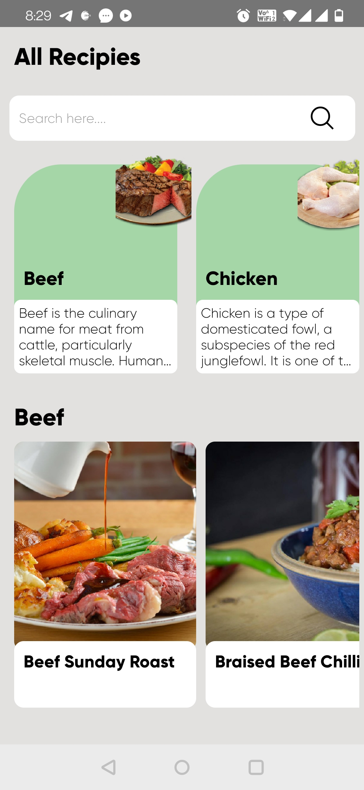
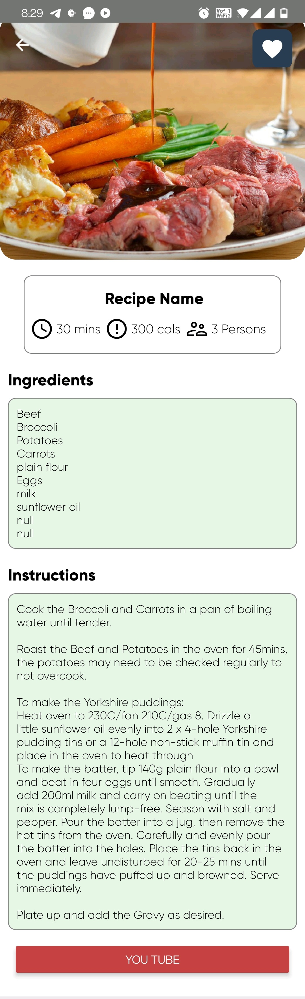

# React-Native-Recipe-App-with-Database

1. Recipe App with React-Native and SQLite database.
2. React Navigation, React Hook, React State.
3. API calls Axios.
4. Vertical Scroll, Horizotal Scroll, FlatList
5. Custom Compoents and fonts.
6. SQlite database for offline access.

Screenshots:

     &nbsp;&nbsp;&nbsp;  
    

     

    
    

     

